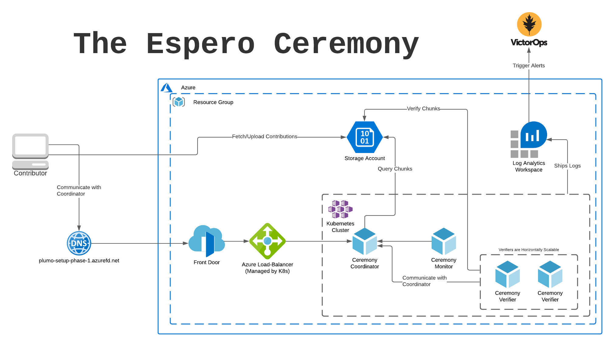

Title: Celo: The Infra Running the Espero Ceremony
Date: 2021-01-22
Author: Conner Swann
Slug: celo-espero-infrastructure
Category: Celo Protocol
Tags: Python, Coda, Blockchain, Discord Bot
Cover: images/2021/celo.jpeg
Status: draft

# What is Celo? 

[Celo](https://celo.org/) is a Cryptocurrency protocol that I contribute to as part of the cLabs team. cLabs's Mission is to ensure "Financial Prosperity for all," which we are executing on by building the ecosystem's first mobile-first blockchain. For many in the world, banking and payments infrastructure is non-existent or hard to get access to, and Celo's goal is to fill that gap. 

In the words of [Polychain Capital President, Joe Eagan](https://www.coindesk.com/libra-minus-facebook-why-celo-is-2020s-buzzy-token-project), “The Celo mobile app, bringing stable payments and remittances to the unbanked, has a chance to bring broad swaths of people to the world of blockchain technology and crypto, but to also level up the economic well-being of those most in need across the globe."

For more details on what Celo is doing and how it does it, I highly recommend checking out [this post](https://medium.com/celoorg/why-build-on-the-celo-blockchain-9ceab3d11b70) on the cLabs Blog by the cLabs CTO Marek Olszewski.

## What is Plumo? 

Since I am hardly an expert on the cryptography involved here, I will mostly be quoting [this great post](https://medium.com/celoorg/the-plumo-ceremony-ac7649e9c8d8) on the cLabs Engineering Blog about Plumo.

> Plumo is a zero-knowledge SNARK based syncing protocol that takes the “lightest sync” mode to the next level. By reducing the time and data needed to sync the blockchain by multiple orders of magnitude, Plumo enables even the most resource constrained mobile devices to transact trustlessly on the Celo network.
> 
> The SNARK at the heart of Plumo enables light clients to sync with the Celo network via ultra-light sync mode. A single SNARK generated by the Plumo protocol can verify over 100 epoch headers instantaneously, allowing light clients to verify this in a quick, light, and trustless way. This results in sync speeds that are orders of magnitude faster, with improvements in the amount of data you need to sync with the Celo network by a factor of around 1,000,000 relative to other networks.
> 
> Plumo is one of the largest SNARKs to be deployed. Internally, it proves the correctness of the evolution of Celo epochs, just as a light client would have seen. This means that essentially it proves the light client protocol. It does this through verifying over 100 BLS signatures that use a combination of a Bowe-Hopwood variant of a Pedersen hash and Blake2s for its hash to curve, and performs the consistency checks of validator elections, asserting that ⅔ of the validator set agreed on the next set. Plumo uses the two-chain of BLS12–377 and BW6 to create BW6 proofs that ultra-light clients verify. This allows them to verify a large number of epochs by verifying a single SNARK proof.
> 
> The SNARK requires one final step before it can go live on mainnet — the Plumo MPC Ceremony, which requires the help of Celo friends and community.

# What is Espero?

Espero is the proper noun used to describe the Plumo Ceremony, again quoting from the blog post: 

> A Multi-Party-Computation (MPC) is a cryptographic mechanism for different parties to jointly perform a computation. SNARK circuits require a “trusted setup” where parties work together to generate shared parameters that can be used to prove and verify SNARKs. If one person ran this setup, then they could potentially prove incorrect things by exploiting a backdoor in the circuit. However, with an MPC, this setup process is split amongst tens or hundreds of contributors, and if even one of the participants is honest (keeps their inputs private), then the system will be secure.
> 
> In the case of the Plumo Ceremony, this collective computation will be a series of joint actions done by a group of participants from within the Celo community and beyond. They will be working to perform an MPC that secures the SNARK proving the Plumo ultralight client protocol.
> 
> The ceremony will consist of rounds of about 6–10 participants each running the Plumo setup software for a certain period of time. Each round will last approximately 36 hours. While much of the activity is passive and involves simply running the computation on a desktop machine, for the Ceremony participants should feel confident with running commands in the terminal and destroying USB keys. This will allow participants to feel comfortable with the commitment so that the Ceremony can run smoothly.
> 
> The SNARK being secured by the Plumo Ceremony is one of the most complex yet powerful SNARKs to ever be secured, and the outcome can be used not only by cLabs & the Plumo construction, but also by any project that uses the BW6 curve with the Groth16 proving system or any other based on polynomial commitments. By participating in this Ceremony, participants can be part of something that is a public good, and will hopefully be used to power many more systems to come.

## Okay, But How Does it _Work_? 

At the end of the day, the Espero Ceremony is just a Typescript JSON API Server that responds to HTTP Requests from various other actors in the system, secured with the same public key cryptogrphy that is the basis for the Celo blockchain. Users who desire to contribute to the ceremony generate a keypair, and share the public key with the Ceremony operator, then signing their HTTP requests for authentication. The Espero ceremony is particularly notable because it is split up into rounds, allowing a small number of participants to contribute their computations in parallel -- a novel innovation in the MPC ecosystem. Other MPC Ceremonies like the OG [Perpetual Powers of Tau](https://github.com/ebfull/powersoftau) only allow for one participant at a time, while not necessarily a limitation mathematically, parallelizing it does allow for larger groups to be involved at once. 

Below, we have a sqeuence diagram that gives a high-level overview of what the contribution binary is doing when one is contributing to the Plumo Setup.

<iframe style="border:none; width:100%; height:100%" scrolling="no" src="https://cdn.swimlanes.io/dist/embeded.html#jZDNTsMwEITvfop5AZJSfg45INEQRQWUoKbcY5ylsZrawXYO8PQ4aVoqlRaO3p2Zz7NOuoYiJLYloxFr5Yx865zUCgV9dKQE4UHyleEbxvZrbXBx59XaVFJx/4xwGWDRG6yDqDu1tijTZIlQkKGNVp8lO5Bv3fuwCPGowmORZyinkwnyp/IscBrgWYs14p62gw3kMJJV2PjdH8zB2GdQdRJ5/9UZwqxPQ+FnfOWvdfXTNfYZ7BfRCVo/IuXscbMD6XWAF6MFWbt1nT3DTXDcXez09L8+twFe20bzyteyrVaWGFPa+c2CWuIOrpYW7find59EXNTo1Djy9xvo/VfyZY5Zks6zbJ6l5Tc=#jZDTc"></iframe>

Here is where the Plumo project intersects with my particular ser of skills. Since the ceremony is easily modelled as a traditional web service, it is trivial to then deploy it in containers to Kubernetes. For the remainder of this post, we're going to discuss the various parts of the deployment (included in the Open Source [Espero Coordinator Repository](https://github.com/celo-org/snark-setup-coordinator)) in the hopes that it is both interesting and relevant to others who want to extend the system. 

## Architecture Diagram

Before getting in too deep, lets look at the system from a high level and identify all the major parts. Below is an architecture diagram outlining the system, including the Microsoft Asure services that were used. 

Important Pieces: 

- **Ceremony Cooridnator:** The brains of the whole ceremony, authenticates users via Public Key signatures and coordinates the metadata required to operate the ceremony efficiently. 
- **Ceremony Verifier:** Communicates with the coordinator, waiting for new contributions and verifying them on the fly. 
- **Ceremony Monitor:** Observes changes in the Coordinator API, emitting logs that can be used for Alerting on important changes in ceremony state. 
- **Azure Front Door:** Used for DDoS mitigation, easy to set up. 
- **Azure Storage Account:** Used store and retrieve chunks, also easy to set up and use. 
- **Kubernetes: and Helm**: Used to deploy and manage the various processes that must run in order to facilitate the ceremony. 
- **Terraform:** Used to wire up and deploy all the various pieces of infradtructure, including Kubernetes Clusters, Load Balancers, and other cloud resources. 