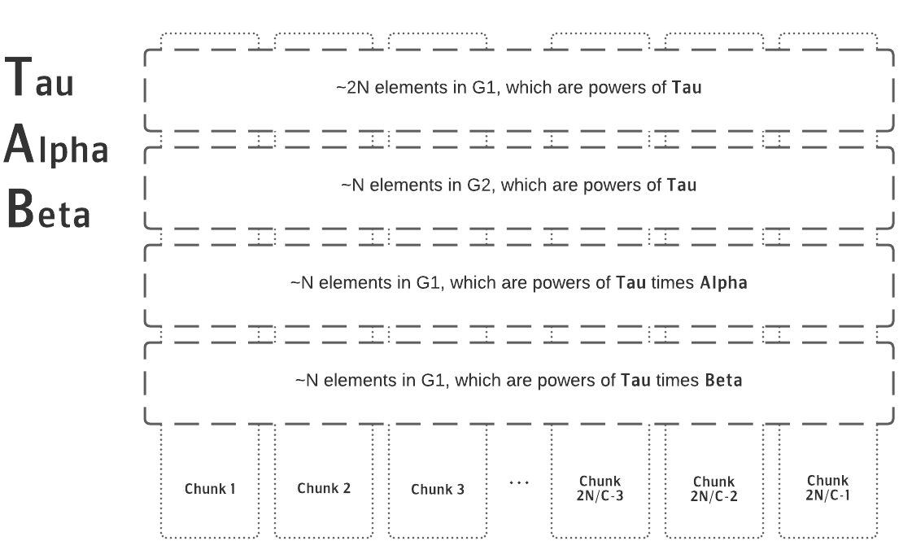

Title: Celo: The Infra Running the Espero Ceremony
Date: 2021-05-01
Author: Conner Swann
Slug: celo-espero-infrastructure
Category: Celo Protocol
Tags: Celo, Plumo, SNARKs, Trusted Setup
Cover: images/2021/celo.jpeg

# Who is This Post For? 

This article was designed for technical readers who are interested in doing any of the following: 

- Someone who is going to fork Espero and run their own MPC Ceremony.
- Someone who has participated in MPCs in the past and wants to know how Espero is _different_.
- Someone who wants to use the output of Phase 1 and use it to do their own Phase 2 setup 
- Someone who wants to use the output of Phase 1 with a universal SNARK such as PLONK or Marlin.

This initial post is a general primer on Plumo and the Espero Ceremony, what they do, and how it all works — from both a high-level perspective and that of the Human operator of the ceremony.  Another post will follow describing the strategy one must have when considering the prospect of their own Phase 2 ceremony. 

## Want To Get Involved? 

The Espero ceremony is only getting started! If you missed out on Phase 1, there is still _plenty_ of time to sign up and contribute to Phase 2 of the Trusted Setup. Simply run a network speed test and [fill out this Google Form](https://docs.google.com/forms/d/1UXrYBDZTKxZEQDFu7VnbJ_KuNMOzJDx_SPx3tp3U3G0/viewform) -- we would _love_ to have you!  

# What is Celo? 

[Celo](https://celo.org/) is a Cryptocurrency protocol that I contribute to as part of the cLabs team. cLabs's Mission is to ensure the conditions of "Financial Prosperity for all," which we are executing on by building the ecosystem's first mobile-first blockchain. For many people globally, banking and payments infrastructure is non-existent or hard to get access to -- Celo's goal is to fill that gap. 

In the words of [Polychain Capital President, Joe Eagan](https://www.coindesk.com/libra-minus-facebook-why-celo-is-2020s-buzzy-token-project), “The Celo mobile app, bringing stable payments and remittances to the unbanked, has a chance to bring broad swaths of people to the world of blockchain technology and crypto, but to also level up the economic well-being of those most in need across the globe."

For more details on what Celo is doing and how it does it, I highly recommend checking out [this post](https://medium.com/celoorg/why-build-on-the-celo-blockchain-9ceab3d11b70) on the cLabs Blog by the cLabs CTO Marek Olszewski.

## What is Plumo? 

Since I am hardly an expert on the cryptography involved here, I will mostly be quoting [this great post](https://medium.com/celoorg/the-plumo-ceremony-ac7649e9c8d8) on the cLabs Engineering Blog about Plumo.

> Plumo is a zero-knowledge SNARK based syncing protocol that takes the “lightest sync” mode to the next level. By reducing the time and data needed to sync the blockchain by multiple orders of magnitude, Plumo enables even the most resource constrained mobile devices to transact trustlessly on the Celo network.
> 
> The SNARK at the heart of Plumo enables light clients to sync with the Celo network via ultra-light sync mode. A single SNARK generated by the Plumo protocol can verify over 100 epoch headers instantaneously, allowing light clients to verify this in a quick, light, and trustless way. This results in sync speeds that are orders of magnitude faster, with improvements in the amount of data you need to sync with the Celo network by a factor of around 1,000,000 relative to other networks.
> 
> Plumo is one of the largest SNARKs to be deployed. Internally, it proves the correctness of the evolution of Celo epochs, just as a light client would have seen. This means that essentially it proves the light client protocol. It does this through verifying over 100 BLS signatures that use a combination of a Bowe-Hopwood variant of a Pedersen hash and Blake2s for its hash to curve, and performs the consistency checks of validator elections, asserting that ⅔ of the validator set agreed on the next set. Plumo uses the two-chain of BLS12–377 and BW6 to create BW6 proofs that ultra-light clients verify. This allows them to verify a large number of epochs by verifying a single SNARK proof.
> 
> The SNARK requires one final step before it can go live on mainnet — the Plumo MPC Ceremony, which requires the help of Celo friends and community.

# What is Espero?

Espero is the proper noun used to describe the Plumo Ceremony, again quoting from the blog post: 

> A Multi-Party-Computation (MPC) is a cryptographic mechanism for different parties to jointly perform a computation. SNARK circuits require a “trusted setup” where parties work together to generate shared parameters that can be used to prove and verify SNARKs. If one person ran this setup, then they could potentially prove incorrect things by exploiting a backdoor in the circuit. However, with an MPC, this setup process is split amongst tens or hundreds of contributors, and if even one of the participants is honest (keeps their inputs private), then the system will be secure.
> 
> In the case of the Plumo Ceremony, this collective computation will be a series of joint actions done by a group of participants from within the Celo community and beyond. They will be working to perform an MPC that secures the SNARK proving the Plumo ultralight client protocol.

Espero improves on top of the existing MPC implementations by introducing the option of optimistic parallel computation. This is possible since contributions are _commutative_. As in, it doesn’t matter in which order participants contribute. Additionally, elements being contributed to can also be worked on independently of one another. Utilizing these properties, Espero divides the contributions into smaller chunks on which participants work in parallel. That works well as long as all the participants contribute to all of the chunks. 

As usual, there’s no free lunch. If even one of the participants decides to stop contributing or maliciously makes a bad contribution, the whole set of contributions that were produced in parallel must be thrown away. This is an organizational consideration that must be made, but there is no risk to security since everything is verifiable. This kind of trade off makes sense when the parameter size is large and you want to make quick progress, but are willing to do more work as the coordinator of the setup to gain confidence that participants will complete their contribution across all the chunks.

> The ceremony will consist of rounds of about 6–10 participants each running the Plumo setup software for a certain period of time. Each round will last approximately 36 hours. While much of the activity is passive and involves simply running the computation on a desktop machine, for the Ceremony participants should feel confident with running commands in the terminal and destroying USB keys. This will allow participants to feel comfortable with the commitment so that the Ceremony can run smoothly.
> 
> The SNARK being secured by the Plumo Ceremony is one of the most complex yet powerful SNARKs to ever be secured, and the outcome can be used not only by cLabs & the Plumo construction, but also by any project that uses the BW6 curve with the Groth16 proving system or any other based on polynomial commitments. By participating in this Ceremony, participants can be part of something that is a public good, and will hopefully be used to power many more systems to come.

## Architecture Diagram

Before getting in too deep, let’s look at the system from a high level and identify all the major parts. Below is an architecture diagram outlining the system, including the Microsoft Azure services that were used. 

Important Pieces: 

- **Ceremony Coordinator:** The brains of the whole ceremony, authenticates users via Public Key signatures and coordinates the metadata required to operate the ceremony efficiently. 
- **Ceremony Contributor:** The brawn of the ceremony, it communicates via signed HTTP packets with the coordinator. It retrieves chunks to be processed and uploads them to Azure Block Storage when complete.
- **Ceremony Verifier:** Communicates with the coordinator, waiting for new contributions and verifying them on the fly. 
- **Ceremony Monitor:** Observes changes in the Coordinator API, emitting logs that can be used for Alerting on important changes in ceremony state. 
- **Azure Front Door:** Used for DDoS mitigation, easy to set up. 
- **Azure Storage Account:** Used to store and retrieve chunks, also easy to set up and use. 
- **Kubernetes: and Helm**: Used to deploy and manage the various processes that must run in order to facilitate the ceremony. 
- **Terraform:** Used to wire up and deploy all the various pieces of infrastructure, including Kubernetes Clusters, Load Balancers, and other cloud resources.

## Okay, But How Does it _Work_? 

At the end of the day, the Espero Ceremony is a Typescript JSON API Server that responds to HTTP Requests from various other actors in the system, secured with the same public key cryptography that is the basis for the Celo (and Ethereum) blockchain. Users who desire to contribute to the ceremony generate a keypair and share the public key with the Ceremony operator, then signing their HTTP requests for authentication. Optionally (but recommended), contributors may also publish an attestation to a public channel like Twitter ([here's mine!](https://twitter.com/YourBuddyConner/status/1339663701498982400)) -- this is to ensure that all of the individuals participating are associated with unique real-world identities (or psuedo-identities) and not just one or more entities colluding. 

The Espero ceremony is particularly notable because it is split up into rounds, allowing a small number of participants to contribute their computations in parallel -- a novel innovation in the MPC ecosystem. Other MPC Ceremonies like the OG [Perpetual Powers of Tau](https://github.com/ebfull/powersoftau) only allow for one participant at a time. While this architecture is not necessarily a limitation based on pure math, parallelizing it does allow for larger groups to be involved at once.

Without getting too deep into the crypto, the gist of an MPC is you download something called a "Structured Reference String," do some computation with it as input, and return the output for the next participant to operate against. **It's like a giant game of _crypto telephone_, where each step along the way is 100% verifiable.** The Structured Reference String consists of four vectors of varying size (see below diagram), each containing field elements from one of two Groups `G1` and `G2`. 

In order to facilitate multiple users in a round, the Structured Reference String is split up into many _chunks_ which consist of slices of the field elements that are to be operated upon. Contributors acquire a "lock" on a chunk, download the chunk's contents, process the computation, and upload the results back to Azure to be verified. 

The below diagram describes logically how the chunks are split: 

While it allows for parallelism in terms of how many users can participate, there is a major constraint to this architecture in that each chunk can only be operated upon by one participant at a time. This requires a high level of coordination by both the party operating the ceremony as well as the individual participating in the ceremony. 

Fortunately, we at cLabs have provided a handy [program, written in Rust](https://github.com/celo-org/snark-setup-operator) that can be used to contribute. Pre-compiled versions of the code are provided on Github, but it is entirely possible (and encouraged) to both read the source code and compile the binary yourself!

Below, we have a sequence diagram that gives a high-level overview of what the contribution binary is doing when you participate in the Plumo Setup.

<iframe style="border:none; width:100%; height:100%" scrolling="no" src="https://cdn.swimlanes.io/dist/embeded.html#lVHLUoMwFN3zFecHhFofCxbOWGSYagccaPfEcC2Z0gSTsNCvN9CHdWqrLnPvedxzYoVtKERsWtIKkZJWi5fOCiVR0FtHkhMeBFtqtva8/VppXNw5tNKVkMw9Q1z6yHuCseB1J1cGZRLPEXDStFbyvfQO4Bv2XixEtEXhschSlOPRCNlTedZw7GOm+ApR77YzG5yDUFRB43a/eA7EXoOqk5b3H50mTHo1FG7Glq6tq6+skdPwfgCdcOtHJK05TnYAvfbxrBUnYzasszXc+MfZ+Q5Pf2ng26cv8tn/urj1sWgbxSpXiWmVNOR5Ulm3yaklZmFrYdBu87w6JWK8Rie3I9f9cHkfI5tnmMTJNE2naVJ+Ag==#lVHg"></iframe>

Since the ceremony coordinator is easily modelled as a traditional web service, it is trivial to then deploy it in containers to Kubernetes. For the remainder of this post, we're going to discuss the various parts of the deployment (included in the Open Source [Espero Coordinator Repository](https://github.com/celo-org/snark-setup-coordinator)) in the hopes that it is both interesting and relevant to others who want to operate and/or extend the system. 

## Aside: Why Microsoft Azure?

Like any Cloud Platform, I see using Azure as a cost/benefit analysis for a given project. The major reason we at cLabs run workloads on Azure is because the Azure Hardware Security Module (HSM) supports the `secp256k1` curve that is the basis for the public key cryptography in Celo (and the Espero Ceremony!). We use this feature for transaction signing among other things, and Google Cloud Platform (my cloud of choice) doesn't currently support this curve in their solution (booo!). Fortunately, Azure provides a perfectly serviceable (if incredibly opinionated/non-intuitive) Kubernetes environment for us to work with. 

Since we were already using Azure, we immediately took a couple tools off the shelf, including Azure Block Storage for chunk storage, Azure Front Door for DDoS mitigation (that we haven't required thus far), and Azure Kubernetes Service for workload management. 

## The Lifecycle of a Ceremony 

Because there is some human intervention required in the Espero Ceremony, an additional actor is introduced called the `Operator`. This entity, like the other actors in the system, authenticates to the Coordinator via private key. The entire lifecycle of the ceremony is managed by the `Coordinator` and administered by the `Operator`, including adding/removing participants, verifying each round, and transitioning between rounds.

The operator commands are located in the control binary — so now let’s walk through initialization and the first round: 

### Ceremony Initialization 

At the very beginning of the ceremony, chunks must be created and uploaded to Azure Block Storage. These make up the initial challenges that each participant in Round 0 will download, compute against, and re-upload. 

### Contributor Enrollment 

The first thing we need to do after initializing the ceremony is add participants. We can do this by using the `add-participant` method, passing an address generated via the `generate` binary as the `--participant-id` argument. 

<pre class="line-numbers">
<code class="language-shell">
./target/release/control --coordinator-url https://plumo-example.azurefd.net \
--keys-file ~/plumo-verifier.keys \
add-participant \
--participant-id ADDRESS
</code>
</pre>

### Round Maintenance

Besides adding users, the control binary can be used to unstick the coordinator which is capable of getting into states where the ceremony cannot proceed -- especially if all participants do not complete their contribution as planned. Additionally, it's important to note that while the Operator can remove data that has already been contributed, it cannot forge data on behalf of a participant. This is ensured by the verifiable public key cryptography that underpins the Espero Ceremony and Plumo SNARK. 

Due to the way the Structured Reference String is broken up, as mentioned previously, each participant must complete their section of the computation on each chunk in order for the ceremony to proceed. There are a plethora of reasons a user could drop out of the ceremony, from slow/inconsistent internet connections to hardware failure. 

If `Participant A` drops out in the middle of the ceremony there are several options: 

1. Have `Participant A` share their private key with someone who may complete the contribution on their behalf, forfeiting some or all of the security guarantees of that particular contribution. 
2. Remove the participant, invalidating all chunks that `Participant A` contributed and also invalidating any descendent chunks created by other participants that used `Participant A`'s chunks as the basis for their own contributions. 

This puts a strong emphasis on maintaining communication with participants and ensuring that private keys are not destroyed before the round is complete and verified. Removing users halfway through really degrades the user experience, so being proactive when this occurs can go a long way. 

### Round Verification 

Because every contribution is signed and verifiable, the coordinator produces a _transcript_ that consists of every operation that was made. This transcript can then be verified by anyone as a chain of custody of sorts that shows the evolution of the Structured Reference String. 

Below is an example of a command that verifies a round: 

<pre class="line-numbers">
<code class="language-shell">
./target/release/control --coordinator-url https://plumo-example.azurefd.net \
--keys-file ~/plumo-verifier.keys new-round \
-e EXPECTED_PARTICIPANT_1 -e EXPECTED_PARTICIPANT_2 \
--verify-transcript \
--publish
</code>
</pre>

### Alerting on Ceremony State 

The Ceremony is structured such that participants are capable of shipping errors to the Coordinator, thereby notifying the Ceremony organizers of potential issues. The most common problem that pops up is simple networking issues, like localized DNS inconsistencies or global network partitions. These error logs are shipped to the Coordinator and show up in its logs to be consumed by alerting tools like the Azure Log Analytics Workspace. 

