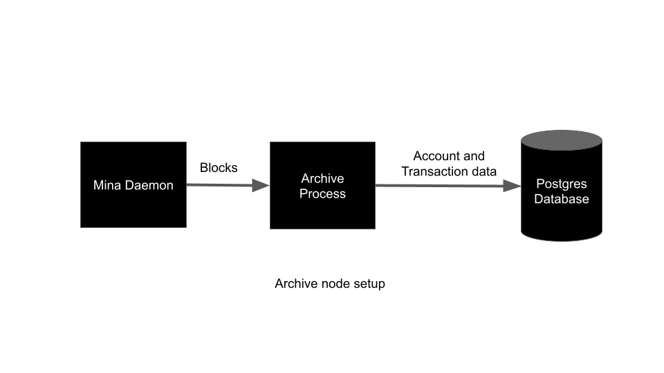

Title: March to Mainnet: Running a Mina Archive Node in Kubernetes
Date: 2021-02-21
Author: Conner Swann
Slug: mina-archive-node-kubernetes
Category: Mina Protocol
Tags: Mina, Blockchain, Archive Node
Cover: images/2019/coda-cover.jpg

## Mina Protocol 

For the uninitiated, Mina Protocol is a new crypto network. Mina implements a "succinct" blockchain that effectively "[swaps the traditional blockchain for a tiny cryptographic proof.](https://minaprotocol.com/)" 

Practically, this means that in the average Mina node, once a block with transactions is "swapped" for a proof, it gets thrown out to save disk space. 

Earlier blockchain implementations like Bitcoin and Ethereum don't have this ability, and as such the hardware requirements for running a Node on their networks increase steadily with the size of their respective chains (240GB and >1TB respectively).

However, due to the succinct property of the Mina blockchain, an archive node is needed to store chain data that is SNARKed away. Whether it be for tax purposes, to calculate staking payouts, or just to have access to the data, numerous organizations will need to run archive nodes, so I decided to spend some time documenting the process for those that will inevitably follow after. 

My approach is a little opinionated, but it derives best-practices from the cutting edge of container orchestration and cloud computing. I definitely recommend this approach, however be aware that this definitely not the only way to cook the sausage here. 

## Technology and Prerequesites

I like Kubernetes. Fortunately, O(1) Labs has provided some handy [Helm Charts](https://github.com/MinaProtocol/mina/tree/develop/helm) that make our collective lives pretty easy and serve as a starting point to build an archive node deployment off of. 

In this post we will focus on deploying to a local Minikube/Docker Desktop cluster, but this will definitely work on any Kubernetes cluster (the _joy_ of Kubernetes!). 

I assume you have the following things set up: 

- A local Kubernetes cluster running and `kubectl` configured. 
- The Helm 3 CLI. 
- PostgreSQL installed locally if you would like to make queries. 

## Archive Node Helm Chart

The Archive Node Helm Chart lives in the Mina Monorepo and can be used to deploy a moderately-resilient Archive process that indexes blocks off the blockchain. It is perfectly suitable for testnets or local development. Since O(1) has a Helm Repo, you can simply install the Repo, provide a `values.yaml` to override the default values, and deploy! 

The chart consists of three discrete processes:

- Mina Daemon - The star of the show, syncs with the blockchain and does all the hard work
- Archive Process - Receives RPC Updates from the Mina Daemon and persists on-chain data to the Postgres DB
- PostgreSQL Database - Stores Archive data (via bitnami sub-chart)




### Install the Helm Repo

The instructions for installing the Mina Helm Repo can be found [here](https://github.com/MinaProtocol/mina/tree/develop/helm/archive-node) and can be found below. 

``` bash
helm repo add mina https://coda-charts.storage.googleapis.com
helm repo update
```

### Helm Chart Values

The default values for the helm chart can be found in the repo [here](https://github.com/MinaProtocol/mina/blob/develop/helm/archive-node/values.yaml). Simply create a yaml file locally that overrides one or more of them like so: 

<pre class="line-numbers">
<code class="language-yaml">
testnetName: "zenith"
coda:
  runtimeConfig: ""
  logLevel: "Info"
  logSnarkWorkGossip: false
  image: gcr.io/o1labs-192920/coda-daemon-baked:0.4.2-245a3f7-zenith-7a89538
  privkeyPass: "naughty blue worm"
  seedPeers:
    - /dns4/seed-1.zenith.o1test.net/tcp/10000/p2p/12D3KooWEEkNQY482QZ9RzTjsAYnczNNWS592guYKZHn9MMAkqpj
    - /dns4/mina-seed-1.zkvalidator.com/tcp/8302/p2p/12D3KooWSR7LMBSfEk3LQUudmsX27yuRHe9NUxwLumurGF5P1MNS
    - /dns4/mina-1.figment.io/tcp/8302/p2p/12D3KooWSkfwArLtqGMht1a9w3z3QiiqA2E6seBRAk378rvanGRZ
  ports:
    client: "8301"
    graphql: "3085"
    metrics: "10001"
    p2p: "10909"

archive:
  hostPort: "10909"
  image: gcr.io/o1labs-192920/coda-archive:0.4.2-245a3f7
  listenPort: "3086"
  nodeName: "dev"
  remoteSchemaFile: "https://raw.githubusercontent.com/MinaProtocol/mina/develop/src/app/archive/create_schema.sql"
  postgresHost: '{{ .Release.Name }}-postgresql'
  postgresPort: "5432"
  postgresDB: "archive"
  postgresUri: postgres://{{ .Values.postgresql.postgresqlUsername }}:{{ .Values.postgresql.postgresqlPassword }}@{{ tpl .Values.archive.postgresHost . }}:{{ .Values.archive.postgresPort }}/{{ .Values.archive.postgresDB }}
  ports:
    server: 3086
    postgres: "5432"

postgresql:
  postgresqlPassword: "foobar"
  postgresqlUsername: "postgres"

healthcheck:
  enabled: true
  failureThreshold: 60
  periodSeconds: 5
  initialDelaySeconds: 30

nodeSelector:
  preemptible: false
</code>
</pre>

There's a couple pieces here that we should examine closely. 

This section is for Mina (previously known as Coda) Daemon configuration variables. I have provided a recently built image (official images can be found [here](gcr.io/o1labs-192920/coda-daemon-baked)), and valid seed peers for the network to which I would like to connect.

<pre class="line-numbers">
<code class="language-yaml">
coda:
  runtimeConfig: ""
  logLevel: "Info"
  logSnarkWorkGossip: false
  image: gcr.io/o1labs-192920/coda-daemon-baked:0.4.2-245a3f7-zenith-7a89538
  seedPeers:
    - /dns4/seed-1.zenith.o1test.net/tcp/10000/p2p/12D3KooWEEkNQY482QZ9RzTjsAYnczNNWS592guYKZHn9MMAkqpj
    - /dns4/mina-seed-1.zkvalidator.com/tcp/8302/p2p/12D3KooWSR7LMBSfEk3LQUudmsX27yuRHe9NUxwLumurGF5P1MNS
    - /dns4/mina-1.figment.io/tcp/8302/p2p/12D3KooWSkfwArLtqGMht1a9w3z3QiiqA2E6seBRAk378rvanGRZ
  ports:
    client: "8301"
    graphql: "3085"
    metrics: "10001"
    p2p: "10909"
</code>
</pre>

This section configures the Archive Node, and we have overriden the Docker Image. It is worth calling out the `archive.remoteSchemaFile` value, which can be used to pass in the remote SQL file that will bootstrap the Database. 
<pre class="line-numbers">
<code class="language-yaml">
archive:
  hostPort: "10909"
  image: gcr.io/o1labs-192920/coda-archive:0.4.2-245a3f7
  listenPort: "3086"
  nodeName: "dev"
  remoteSchemaFile: "https://raw.githubusercontent.com/MinaProtocol/mina/develop/src/app/archive/create_schema.sql"
  postgresHost: '{{ .Release.Name }}-postgresql'
  postgresPort: "5432"
  postgresDB: "archive"
  postgresUri: postgres://{{ .Values.postgresql.postgresqlUsername }}:{{ .Values.postgresql.postgresqlPassword }}@{{ tpl .Values.archive.postgresHost . }}:{{ .Values.archive.postgresPort }}/{{ .Values.archive.postgresDB }}
  ports:
    server: 3086
    postgres: "5432"
</code>
</pre>

## Deploy it! 

So, now that we have a `values.yaml` file locally, and assuming we have installed the Mina Helm Repo correctly, we can do the following: 

<pre class="line-numbers">
<code class="language-shell">
$ helm install --values values.yaml archive mina/archive-node
NAME: archive
LAST DEPLOYED: Sun Feb 21 19:03:12 2021
NAMESPACE: archive
STATUS: deployed
REVISION: 1
TEST SUITE: None
NOTES:
</code>
</pre>

We can check the deployment by viewing the currently running pods: 

<pre class="line-numbers">
<code class="language-shell">
$ kubectl get pods
NAME                         READY   STATUS      RESTARTS   AGE
archive-5d9b967557-pkk2g     2/2     Running     0          37s
archive-db-bootstrap-25mml   0/3     Completed   0          37s
archive-db-bootstrap-nhp7f   0/3     Error       0          25s
archive-db-bootstrap-nx9rw   0/3     Error       0          15s
archive-postgresql-0         1/1     Running     0          37s
</code>
</pre>

Note: Depending on how long it takes for the Postgres container to pull and start, you might see one or more failed `archive-db-bootstrap-xxxxx` jobs, this is normal. 

You can check your daemon's sync status with the following command: 

`kubectl exec $(pods | grep archive- | head -n 1 | awk '{print $1}') -c coda -- coda client status`

You should get output that looks similar to this: 

<pre class="line-numbers">
<code class="language-shell">
$ kubectl exec $(pods | grep archive- | head -n 1 | awk '{print $1}') -c coda -- coda client status
Coda daemon status
-----------------------------------

Max observed block height:              932
Max observed unvalidated block height:  0
Local uptime:                           2m42s
Chain id:                               394692fea7f6531810be6ef213959856010881425920d396be39009d53045074
Git SHA-1:                              [DIRTY]245a3f7d883c516f5f16742cb1ca672872612851
Configuration directory:                /root/.coda-config
Peers:                                  33
User_commands sent:                     0
SNARK worker:                           None
SNARK work fee:                         100000000
Sync status:                            Bootstrap
Block producers running:                0
Consensus time now:                     epoch=0, slot=2076
Consensus mechanism:                    proof_of_stake
Consensus configuration:                
        Delta:                     0
        k:                         290
        Slots per epoch:           7140
        Slot duration:             3m
        Epoch duration:            14d21h
        Chain start timestamp:     2021-02-17 19:30:00.000000Z
        Acceptable network delay:  3m

Addresses and ports:                    
        External IP:    <IP ADDRESS>
        Bind IP:        0.0.0.0
        Libp2p PeerID:  12D3KooWSfZd2tcaB5oPbu34KzcREoN8BNhQLofmSDguG3dRXzPS
        Libp2p port:    10909
        Client port:    8301
</code>
</pre>

Eventually, after ~10 minutes or so, your Daemon will be `Synced` and chain data will be flowing to your Postgres database. 

## Ok, now what? 

Now, you have a working, running Archive Node! Lets run a test query to see whats in the database. 

First, we should forward the Postgres port from the Database container to `localhost` with `kubectl`: 

<pre class="line-numbers">
<code class="language-shell">
$ k port-forward archive-postgresql-0  5432
Forwarding from 127.0.0.1:5432 -> 5432
Forwarding from [::1]:5432 -> 5432
</code>
</pre>

In another terminal, connect to the database with the `psql` client using the credentials we set in the `values.yaml` above: 

<pre class="line-numbers">
<code class="language-shell">
$ psql -h localhost --user postgres
Password for user postgres: 
psql (13.2, server 11.10)
Type "help" for help.

postgres=# 
</code>
</pre>

We can list the databases, switch to the archive database, list the tables, and query one of them: 

<pre class="line-numbers">
<code class="language-shell">
$ psql -h localhost --user postgres
Password for user postgres: 
psql (13.2, server 11.10)
Type "help" for help.

postgres=# \l
                                  List of databases
   Name    |  Owner   | Encoding |   Collate   |    Ctype    |   Access privileges   
-----------+----------+----------+-------------+-------------+-----------------------
 archive   | postgres | UTF8     | en_US.UTF-8 | en_US.UTF-8 | 
 postgres  | postgres | UTF8     | en_US.UTF-8 | en_US.UTF-8 | 
 template0 | postgres | UTF8     | en_US.UTF-8 | en_US.UTF-8 | =c/postgres          +
           |          |          |             |             | postgres=CTc/postgres
 template1 | postgres | UTF8     | en_US.UTF-8 | en_US.UTF-8 | =c/postgres          +
           |          |          |             |             | postgres=CTc/postgres
(4 rows)

postgres=# \c archive 
psql (13.2, server 11.10)
You are now connected to database "archive" as user "postgres".
archive=# \dt
                  List of relations
 Schema |           Name           | Type  |  Owner   
--------+--------------------------+-------+----------
 public | balances                 | table | postgres
 public | blocks                   | table | postgres
 public | blocks_internal_commands | table | postgres
 public | blocks_user_commands     | table | postgres
 public | epoch_data               | table | postgres
 public | internal_commands        | table | postgres
 public | public_keys              | table | postgres
 public | snarked_ledger_hashes    | table | postgres
 public | timing_info              | table | postgres
 public | user_commands            | table | postgres
(10 rows)

archive=# SELECT id, state_hash, parent_id, parent_hash, creator_id, height, global_slot FROM BLOCKS LIMIT 5;
 id |                      state_hash                      | parent_id |                     parent_hash                      | creator_id | height | global_slot 
----+------------------------------------------------------+-----------+------------------------------------------------------+------------+--------+-------------
  1 | 3NL4SSDnG5EbFBV8kj5J3fmwuABQzUBrybVEHwYiGmudJUJMAFkc |           | 3NLr2QiYhu2mp4GhzEmVty1yWpW7QkkEjrkYJUrzBHgLRvDNL1nY |          1 |    642 |        1537
  2 | 3NKqnVZJYHWHmsNujM21HHDt2U7PVDLsu7AxnTq1uzjNKw1Rx6iC |         1 | 3NL4SSDnG5EbFBV8kj5J3fmwuABQzUBrybVEHwYiGmudJUJMAFkc |          1 |    643 |        1538
  3 | 3NLnmcUMRF9TproRxydkwqvtjYQjzNw59koQ62GYb4MRHKuQj1P1 |         2 | 3NKqnVZJYHWHmsNujM21HHDt2U7PVDLsu7AxnTq1uzjNKw1Rx6iC |          6 |    644 |        1539
  4 | 3NKZ1uZPPqssNtKkvwN3gDgw6vsuWjSDervuSd8QBEy2nswwgc4w |         3 | 3NLnmcUMRF9TproRxydkwqvtjYQjzNw59koQ62GYb4MRHKuQj1P1 |          9 |    645 |        1540
  5 | 3NKqcnzLzNScVMQf6xV1uBz1LnLTw9pedR8NfRtSa9tFkXxvbDqV |         4 | 3NKZ1uZPPqssNtKkvwN3gDgw6vsuWjSDervuSd8QBEy2nswwgc4w |         11 |    646 |        1542
(5 rows)
</code>
</pre>

Now, there are a few limitations here. For the moment, there is no way to retrieve missing blocks from the chain. As such, you will need to have a nice friend with a SQL dump of their database to fill in the gaps. However, this definitely provides a workable dev environment for those requiring access to a working Archive node. Good work around Archive node redundancy is being done, details can be found in this Docs commit [here](https://github.com/MinaProtocol/mina/blob/0351fc31e9f5e29dc87a04bb55f3cdc5aee2038e/docs/archive-redundancy.md). 

There is so much to do from here, like adding the `mina-rosetta` server to expose data in a consistent format for the Ledger, Postgres database backups, and more! 

I invite you to try this out and stay tuned for more posts in this _March to Mainnet_ series. Next time, how to hook up this Archive deployment to your Ledger for fun and profit! 

