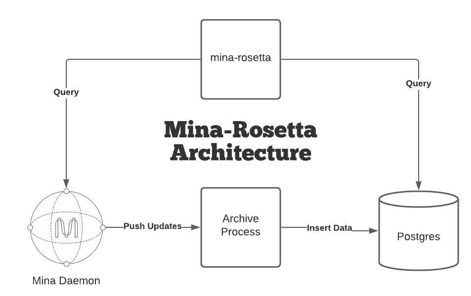
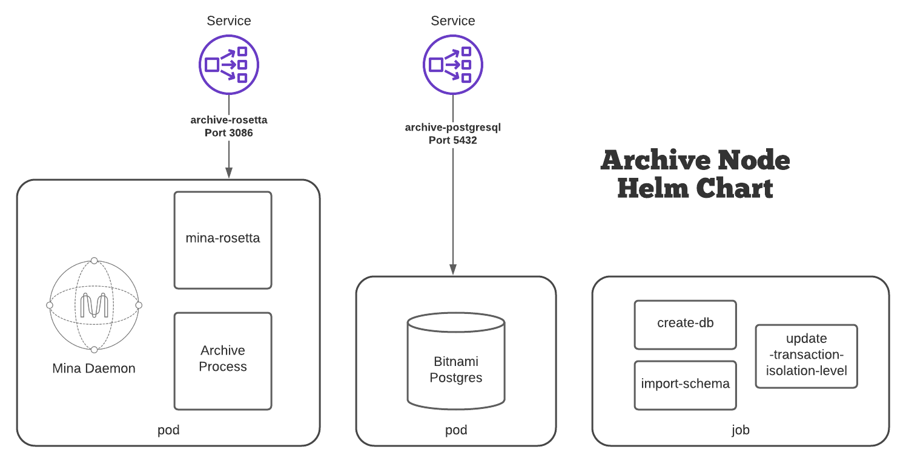
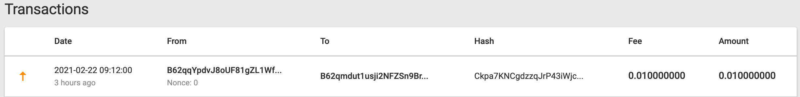

Title: March to Mainnet: Sending a Transaction With Your Ledger Hardware Wallet
Date: 2021-02-22
Author: Conner Swann
Slug: mina-ledger-app
Category: Mina Protocol
Tags: Mina, Blockchain, Archive Node
Cover: images/2019/coda-cover.jpg

# Need to Test your Ledger?

Mina Mainnet is upon us, if you are one of those who opted to self-custody their Mina tokens, chances are you generated your addresses with a Ledger Nano S. Now, your next step is to send some transactions with it, but you might be surprised to learn that it's not quite as easy as running a Mina daemon locally! Don't worry, it's still pretty easy, but you need a helping hand from the Mina Archive node and the `mina-rosetta` API. 


In this installment of the Mina _March to Mainnet_ series we will be covering how to send transactions with a Ledger hardware wallet. We'll also introduce the Sushi Validator Archive Helm Chart, which can be used to deploy a production-ready instance of the Archive Node with Rosetta to a Kubernetes cluster of your choice. 

## Prerequisites 

Since I love Kubernetes, I am going to have a pretty opinionated setup, but I think _everyone_ should have a little understanding of how Containers and Kubernetes work in 2021. Fortunately, O(1) Labs has provided some Helm Charts that offer a good starting place when building a Mina deployment. 

You will need the following things in order to fully follow along with this post: 

- A kubernetes cluster running and `kubectl` configured (I use the Kubernetes feature on Docker Desktop)
- Helm 3 installed 

It also might help to at least skim through the last post in the _March to Mainnet_ Series [about the Archive Node Helm Chart](https://connerswann.me/2021/02/mina-archive-node-kubernetes.html), which sets the scene for all the concepts we will cover in this post. 

A last note: The word "ledger" is incredibly overloaded in the crypto world. In this post I try to differentiate between the company/Hardware Wallet `Ledger` (ex. Ledger Nano S) and the generic word `ledger` (ex. genesis ledger) which describes a list of accounts in a blockchain system. 

## Install Mina Ledger App

If you have an address in the Mina Genesis Ledger, you should have already done this step and generated your address using the `mina_ledger_wallet` utility. However, instructions for installing it can be [found here](https://minaprotocol.com/docs/keypair/ledger-app-mina).

I am assuming that you have placed the `mina_ledger_wallet` program somewhere in your `$PATH`, and if you don't the commands you might use will be slightly different than those in this post. 

If you have done your due dilligence, you might have run `mina_ledger_wallet test-transaction` which creates and signs a dummy transaction offline. This only requires the Ledger to preform successfully. 

If you were curious and tried to run `mina_ledger_wallet send-payment` though, you might discover you get an error: 

```
$ mina_ledger_wallet --verbose send-payment --network testnet  --fee .01 42 <SenderKey> <ReceiverKey> .01
Getting network identifier... Error: HTTPConnectionPool(host='localhost', port=3087): Max retries exceeded with url: /network/list (Caused by NewConnectionError('<urllib3.connection.HTTPConnection object at 0x1105912b0>: Failed to establish a new connection: [Errno 61] Connection refused'))
```

Question: What is the `mina_ledger_wallet` program expecting to be running on port `3087`? The Mina Graphql Port binds to port `3085` by default...

Answer: `mina_ledger_wallet` is looking for the `mina-rosetta` API! 

This actually makes sense, `mina_ledger_wallet` needs up-to-date information from the blockchain about your account in order to properly format the transaction. Lets get that set up!

## Run an Archive Node with Rosetta 

In the [last post](https://connerswann.me/2021/02/mina-archive-node-kubernetes.html), we discussed using the official Archive Node Helm Chart to install an Archive Node in Kubernetes. The official chart is designed for testnets, works great for development, and archives blocks no problem. However, to send transactions with the Ledger Nano S, we need the Rosetta API too! 

First, an aside, what _exactly_ is Rosetta? 

From the [rosetta-api website](https://www.rosetta-api.org/): 

> Rosetta is an open standard designed to simplify blockchain deployment and interaction. Spend less time on integration and more time on novel blockchain advancements.



Rosetta provides a nice standard API for every blockchain, which can be a pain from the perspective of one writing a blockchain, but it is _hugely_ useful when a big organization just forces everyone to adhere to the _same API_. Rosetta runs as a sidecar to the Archive Node deployment, consuming the GraphQL Port on the Daemon as well as data from the Postgres Database directly. 

</hr>

In order to facilitate the deployment of Rosetta, and add some more production-oriented features, we at the Sushi Validator forked the official chart and are hosting it on the official [Sushi Validator](https://minastakingpool.connerswann.me/) helm repository [here](https://github.com/Sushi-Validator/helm-charts). 


The `values.yaml` is compatible with the official chart, and is a super-set of the existing fields. Most notably, a `rosetta` section was added: 

<pre class="line-numbers">
<code class="language-yaml">
rosetta: 
  image: gcr.io/o1labs-192920/coda-daemon-baked:0.4.2-245a3f7-zenith-7a89538
  graphqlUri: http://127.0.0.1:3085/graphql 
  archiveUri: '{{ $.Values.archive.postgresUri }}'
  ports:
    web: 3087
</code>
</pre>

Note: Fortunately O(1) packages the `mina-rosetta` binary in the `coda-daemon-baked` image, so we can use the same exact image as the Mina Daemon here.

A complete example `values.yaml` follows: 

<pre class="line-numbers">
<code class="language-yaml">
testnetName: "zenith"
coda:
  runtimeConfig: ""
  logLevel: "Info"
  logSnarkWorkGossip: false
  image: gcr.io/o1labs-192920/coda-daemon-baked:0.4.2-245a3f7-zenith-7a89538
  privkeyPass: "naughty blue worm"
  seedPeers:
    - /dns4/seed-1.zenith.o1test.net/tcp/10000/p2p/12D3KooWEEkNQY482QZ9RzTjsAYnczNNWS592guYKZHn9MMAkqpj
    - /dns4/mina-seed-1.zkvalidator.com/tcp/8302/p2p/12D3KooWSR7LMBSfEk3LQUudmsX27yuRHe9NUxwLumurGF5P1MNS
    - /dns4/mina-1.figment.io/tcp/8302/p2p/12D3KooWSkfwArLtqGMht1a9w3z3QiiqA2E6seBRAk378rvanGRZ
  ports:
    client: "8301"
    graphql: "3085"
    metrics: "10001"
    p2p: "10909"

archive:
  hostPort: "10909"
  image: gcr.io/o1labs-192920/coda-archive:0.4.2-245a3f7
  listenPort: "3086"
  nodeName: "dev"
  remoteSchemaFile: "https://raw.githubusercontent.com/MinaProtocol/mina/develop/src/app/archive/create_schema.sql"
  postgresHost: '{{ .Release.Name }}-postgresql'
  postgresPort: "5432"
  postgresDB: "archive"
  postgresUri: postgres://{{ .Values.postgresql.postgresqlUsername }}:{{ .Values.postgresql.postgresqlPassword }}@{{ tpl .Values.archive.postgresHost . }}:{{ .Values.archive.postgresPort }}/{{ .Values.archive.postgresDB }}
  ports:
    server: 3086
    postgres: "5432"

postgresql:
  postgresqlPassword: "foobar"
  postgresqlUsername: "postgres"

rosetta: 
  image: gcr.io/o1labs-192920/coda-daemon-baked:0.4.2-245a3f7-zenith-7a89538
  graphqlUri: http://127.0.0.1:3085/graphql 
  archiveUri: '{{ $.Values.archive.postgresUri }}'
  ports:
    web: 3087

healthcheck:
  enabled: true
  failureThreshold: 60
  periodSeconds: 5
  initialDelaySeconds: 30

nodeSelector:
  preemptible: false
</code>
</pre>

Now, given this `values.yaml`, all we need to do now is add the Sushi Validator helm repository: 

<pre class="line-numbers">
<code class="language-shell">
helm repo add sushi https://charts.sushivalidator.com
helm repo update
</code>
</pre>
 

We can install the chart like so: 

<pre class="line-numbers">
<code class="language-shell">
helm install --values values.yaml archive sushi/archive-node/
NAME: archive
LAST DEPLOYED: Sun Feb 22 19:03:12 2021
NAMESPACE: archive
STATUS: deployed
REVISION: 1
TEST SUITE: None
NOTES:
</code>
</pre>

Once installed, we'll get a deployment that looks like this: 




We can check the deployment by viewing the currently running pods: 

<pre class="line-numbers">
<code class="language-shell">
$ kubectl get pods
NAME                         READY   STATUS      RESTARTS   AGE
archive-5d9b967557-pkk2g     3/3     Running     0          37s
archive-db-bootstrap-25mml   0/3     Completed   0          37s
archive-db-bootstrap-nhp7f   0/3     Error       0          25s
archive-db-bootstrap-nx9rw   0/3     Error       0          15s
archive-postgresql-0         1/1     Running     0          37s
</code>
</pre>

Note: Depending on how long it takes for the Postgres container to pull and start, you might see one or more failed `archive-db-bootstrap-xxxxx` jobs, this is normal. 

You can check your daemon's sync status with the following command: 

`kubectl exec $(pods | grep archive- | head -n 1 | awk '{print $1}') -c coda -- coda client status`

You should get output that looks similar to this: 

<pre class="line-numbers">
<code class="language-shell">
$ kubectl exec $(pods | grep archive- | head -n 1 | awk '{print $1}') -c coda -- coda client status
Coda daemon status
-----------------------------------

Max observed block height:              932
Max observed unvalidated block height:  0
Local uptime:                           2m42s
Chain id:                               394692fea7f6531810be6ef213959856010881425920d396be39009d53045074
Git SHA-1:                              [DIRTY]245a3f7d883c516f5f16742cb1ca672872612851
Configuration directory:                /root/.coda-config
Peers:                                  33
User_commands sent:                     0
SNARK worker:                           None
SNARK work fee:                         100000000
Sync status:                            Bootstrap
Block producers running:                0
Consensus time now:                     epoch=0, slot=2076
Consensus mechanism:                    proof_of_stake
Consensus configuration:                
        Delta:                     0
        k:                         290
        Slots per epoch:           7140
        Slot duration:             3m
        Epoch duration:            14d21h
        Chain start timestamp:     2021-02-17 19:30:00.000000Z
        Acceptable network delay:  3m

Addresses and ports:                    
        External IP:    <IP ADDRESS>
        Bind IP:        0.0.0.0
        Libp2p PeerID:  12D3KooWSfZd2tcaB5oPbu34KzcREoN8BNhQLofmSDguG3dRXzPS
        Libp2p port:    10909
        Client port:    8301
</code>
</pre>

Eventually, after ~10 minutes or so, your Daemon will be `Synced` and chain data will be flowing to your Postgres database. 

## A Little About Rosetta

Rosetta is an initiative from Coinbase, providing a standard API for applications built on top of blockchains to interact with the underlying ledger. It is a robust and well-tested interface, and it's pretty nice to work with. I think it would be fun to write some posts about writing applications on top of `mina-rosetta`.

If you want to poke around, there is a cool rosetta-api client which can be found [on github, here.](https://github.com/coinbase/rosetta-cli)

We can port-forward the Rosetta API Port so the CLI can communicate with the remote pod:

<pre class="line-numbers">
<code class="language-shell">
kubectl port-forward $(pods | grep archive- | head -n 1 | awk '{print $1}')  3087
</code>
</pre>

Next, we need to configure the `rosetta-cli` with a `rosetta.conf` -- an example [can be found here](https://gist.github.com/yourbuddyconner/89837c85b409439bdd07acdd37425e34).

Now we can do things like query blocks: 

<pre class="line-numbers">
<code class="language-shell">
$ rosetta-cli --configuration-file rosetta.conf view:block 1
loaded configuration file: rosetta.conf

Current Block:
{
 "block_identifier": {
  "index": 1,
  "hash": "3NLH8GM4afTu4UdbE6nD5yELa5yV78PzdN8QTYYXrL7g1xoPhBGw"
 },
 "parent_block_identifier": {
  "index": 1,
  "hash": "3NLH8GM4afTu4UdbE6nD5yELa5yV78PzdN8QTYYXrL7g1xoPhBGw"
 },
 "timestamp": 0,
 "transactions": [],
 "metadata": {
  "creator": "B62qiy32p8kAKnny8ZFwoMhYpBppM1DWVCqAPBYNcXnsAHhnfAAuXgg"
 }
}
Balance Changes:
Cummulative: 3NLH8GM4afTu4UdbE6nD5yELa5yV78PzdN8QTYYXrL7g1xoPhBGw

Operation Groups:
</code>
</pre>

## mina_ledger_wallet CLI 

Now for the reason we are all here, lets send some transactions. Now that we have a Rosetta API running, and port-forwarded (if you didn't do this, go do it now!), we can  now use the `mina_ledger_wallet` CLI to send a transaction. 

Lets look at the help output: 

<pre class="line-numbers">
<code class="language-shell">
$ mina_ledger_wallet send-payment -h 
usage: mina_ledger_wallet send-payment [-h] [--mina_url MINA_URL] [--network NETWORK] [--fee FEE] [--nonce NONCE] [--valid_until VALID_UNTIL] [--memo MEMO]
                                       sender_bip44_account sender_address receiver amount

positional arguments:
  sender_bip44_account  BIP44 account to send from (e.g. 42)
  sender_address        Mina address of sender
  receiver              Mina address of recipient
  amount                Payment amount you want to send

optional arguments:
  -h, --help            show this help message and exit
  --mina_url MINA_URL   Mina rosetta interface url (default http://localhost:3087)
  --network NETWORK     Network override
  --fee FEE             Fee override
  --nonce NONCE         Nonce override
  --valid_until VALID_UNTIL
                        Valid until
  --memo MEMO           Transaction memo (publicly visible)
</code>
</pre>

So, a properly formatted command sending `0.1` Mina from `<SenderAddress>` to `<ReceiverAddress>` would look something like: 

<pre class="line-numbers">
<code class="language-shell">
mina_ledger_wallet \
    send-payment \
    --network testnet \
    --mina_url http://localhost:3087 \
    --fee .01 \
    42 \
    SenderAddress \
    ReceiverAddress \
    0.1
</code>
</pre>
 
## Send a Transaction

Lets do it! 

Here's some example output from that command: 

<pre class="line-numbers">
<code class="language-shell">
$ mina_ledger_wallet --verbose send-payment --network testnet --mina_url http://localhost:3087 --fee .01 42 B62qqYpdvJ8oUF81gZL1WfLef1Ky8SsdvmUyfpr7YWb2m2rjRxaEcxq B62qmdut1usji2NFZSn9BrywhjHakYtAvL7Mdy7muyjcbrY3hKJ688Y .01
Using rosetta override: http://localhost:3087
Getting network identifier... debug
Using network override: testnet
Getting account nonce and suggested fee... done
Using fee override: .01
Using nonce override: 2
Getting account balance... done

Sign transaction:
    Type:        Payment
    Account:     42 (path 44'/12586'/42'/0/0)
    Sender:      B62qqYpdvJ8oUF81gZL1WfLef1Ky8SsdvmUyfpr7YWb2m2rjRxaEcxq (balance 0.98)
    Receiver:    B62qmdut1usji2NFZSn9BrywhjHakYtAvL7Mdy7muyjcbrY3hKJ688Y
    Amount:      0.010000000
    Fee:         0.010000000
    Total:       0.020000000
    Nonce:       2

Continue? (y/N) y

Constructing unsigned payment transaction... done

UNSIGNED_TX = {"randomOracleInput": "", "payment": {"to": "B62qmdut1usji2NFZSn9BrywhjHakYtAvL7Mdy7muyjcbrY3hKJ688Y", "from": "B62qqYpdvJ8oUF81gZL1WfLef1Ky8SsdvmUyfpr7YWb2m2rjRxaEcxq", "fee": "10000000", "token": "1", "nonce": "2", "memo": null, "amount": "10000000", "valid_until": null}, "stakeDelegation": null, "createToken": null, "createTokenAccount": null, "mintTokens": null}

Signing transaction (please confirm on Ledger device)... 
apduMessage hex (346) = <HEX_OUTPUT>

SIGNED_TX   = {"signature": "1f0f4ef044b259a1851cfffc98307beef4b388047dcf57de53debdce83fa2d661e1dc6db0b2c14aef2cd6227682ac5376f5561a741b7f6338ea55245e190eea8", "payment": {"to": "B62qmdut1usji2NFZSn9BrywhjHakYtAvL7Mdy7muyjcbrY3hKJ688Y", "from": "B62qqYpdvJ8oUF81gZL1WfLef1Ky8SsdvmUyfpr7YWb2m2rjRxaEcxq", "fee": "10000000", "token": "1", "nonce": "2", "memo": null, "amount": "10000000", "valid_until": "4294967295"}, "stake_delegation": null, "create_token": null, "create_token_account": null, "mint_tokens": null}


Send transaction:
    Type:        Payment
    Account:     42 (path 44'/12586'/42'/0/0)
    Sender:      B62qqYpdvJ8oUF81gZL1WfLef1Ky8SsdvmUyfpr7YWb2m2rjRxaEcxq (balance 0.98)
    Receiver:    B62qmdut1usji2NFZSn9BrywhjHakYtAvL7Mdy7muyjcbrY3hKJ688Y
    Amount:      0.010000000
    Fee:         0.010000000
    Total:       0.020000000
    Nonce:       2
    Signature:   1f0f4ef044b259a1851cfffc98307beef4b388047dcf57de53debdce83fa2d661e1dc6db0b...

Continue? (y/N)
</code>
</pre>

I didn't actually send this test transaction, but you totally can and should!

You can check your balance on MinaExplorer.com by plugging your sender or receiver address into the following URL and visiting it in your browser: 

`https://minaexplorer.com/wallet/<ADDRESS>`

With any luck, you should see something like this: 

