Title: Optics: How to Ape With Etherscan
Date: 2021-01-22
Author: Conner Swann
Slug: optics-ape-with-etherscan
Category: Celo Protocol
Tags: Optics, Celo, Etherscan, Apes Together Strong
Cover: images/2021/optics-hero.jpeg
Status: draft

# Optics is Here 
Optics is a new optimistic multi-chain communication standard developed by the Optics Core team at cLabs. [Check out the release blog post!](https://medium.com/celoorg/optics-is-here-42aa610675ce) This release coincides with [Defi For the People](https://www.defiforthepeople.org/), a truly massive incentive campaign that aims to attract dApp developers to the Celo Ecosystem along with their killer dApps!

Now that Optics has been deployed to Mainnet Ethereum, Celo, and Polygon, many are asking the obvious question: 

**"How do I Ape?"**

Read on dear Ape, for in this blog post we will go over how to send tokens over the Optics bridge *(and be ready to take advantage of the soon-to-be-announced liquidity incentives)* via Etherscan in lieu of a dedicated Optics GUI (which is actively in development!). 

**READ THIS NOTE:**  ⚠️ *Optics is still an experimental technology. We are deploying it for the first time in mainnet environments, so it’s important to carefully evaluate the risks and only transact with funds you’re willing to play with!* ⚠️

# What We Need To Know 

*Did you read the note in the previous section? Good.*

Optics is a highly complex mesh of inter-connected smart contracts, which we will mostly be glossing over in favor of aping tokens onto the bridge and reaching multi-chain enlightenment as fast as possible. If you are interested in learning more (and you *should be*), here are some links to the Optics documentation in the github repo: 

- [Optics Overview](https://github.com/celo-org/optics-monorepo/tree/main/docs)
- [Optics Channel Architecture](https://github.com/celo-org/optics-monorepo/blob/main/docs/architecture.md)
- [Optics Token Bridge xApp](https://github.com/celo-org/optics-monorepo/blob/main/docs/xapps/token-bridge.md)

Now, lets talk about the parts we need to know about. 

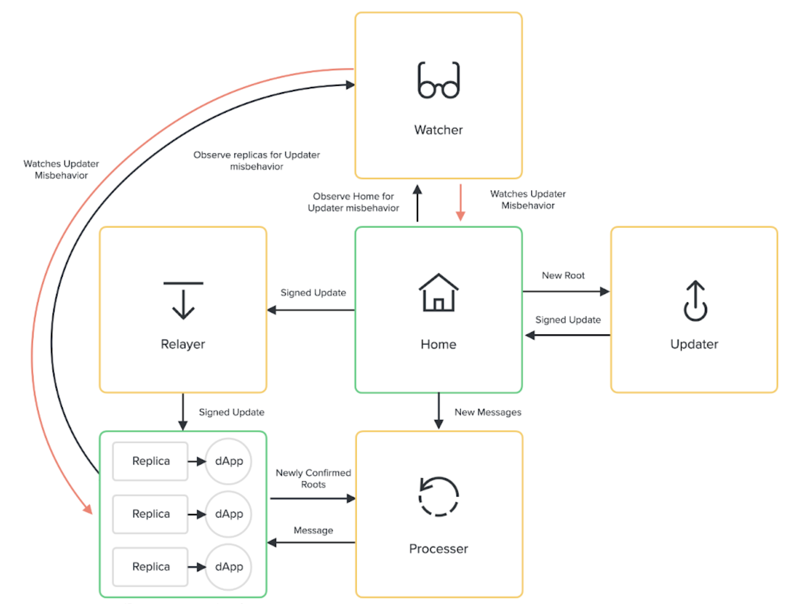

## The Home Contract

The Home contract is the hub of one-way communication between the blockchain it is deployed to, and replica contracts on an arbitrary number of remote blockchains. Messages are persisted to the Home blockchain by a "Cross-Chain App" (aka a xApp), and ferried to the replicas by a series of *off-chain agents*. It is important to note that message-passing *is not instantaneous*, as there is a ~3-hour dispute period in addition to any confirmation time on the home chain to see messages processed on a replica chain. 

Contract addresses for the mainnet Home and other core contracts can be found in the Optics Repository [here](https://github.com/celo-org/optics-monorepo/tree/main/rust/config/mainnet)

## The Token Bridge

Now that we know roughly how an Optics channel works, we can go over the most important piece to a quickly evolving Bridge Ape -- The Token Bridge. 

The Token Bridge is a xApp, the first of its kind in the Optics Ecosystem, that facilitates token transfers between blockchains. If you know how to call its methods via Etherscan, you can send tokens across the bridge. 

Contract addresses for the various components of the Token Bridge can be found [here](https://github.com/celo-org/optics-monorepo/tree/main/rust/config/mainnet/bridge/1631143085018)

## Etherscan 

Etherscan is a *great tool* for the Ethereum ecosystem. One well-known feature to DeFi Apes is the ability to natively call smart contract methods for any *verified* smart contract via a Metamask integration. We can utilize this functionality to our benefit to send tokens from Ethereum to Celo. 

It is important to note that this functionality is available on any blockchain where Etherscan is deployed. Since Etherscan is not deployed to Celo, you will not be able to send your tokens back to the originating chain until the GUI is released. But, you didn't want to send them back anyways, right? 

# I am Become Bridge Ape

We're almost to the point where we have enough information to become one with the bridge and achieve enlightenment. 

## Step One: Locate the Bridge Router Contract

As mentioned in the previous section, bridge contract addresses on each blockchain can be found [here](https://github.com/celo-org/optics-monorepo/tree/main/rust/config/mainnet/bridge/1631143085018). 

Optics is deployed in an upgradeable configuration, with *implementation contracts* being pointed to by *proxy contracts*. This allows us to upgrade the contract implementation via governance without having to migrate contract state (which lives in the proxy). 

We want to interact with the BridgeRouter proxy contract which can be found on Etherscan [here](https://etherscan.io/address/0x6a39909e805A3eaDd2b61fFf61147796ca6aBB47). 

## Step Two: Locate the "Send" Method

In order to view the implementation details of a contract, select the "Contract" tab. Note: The green checkmark indicates that the source code of the contract has been verified on Etherscan. 

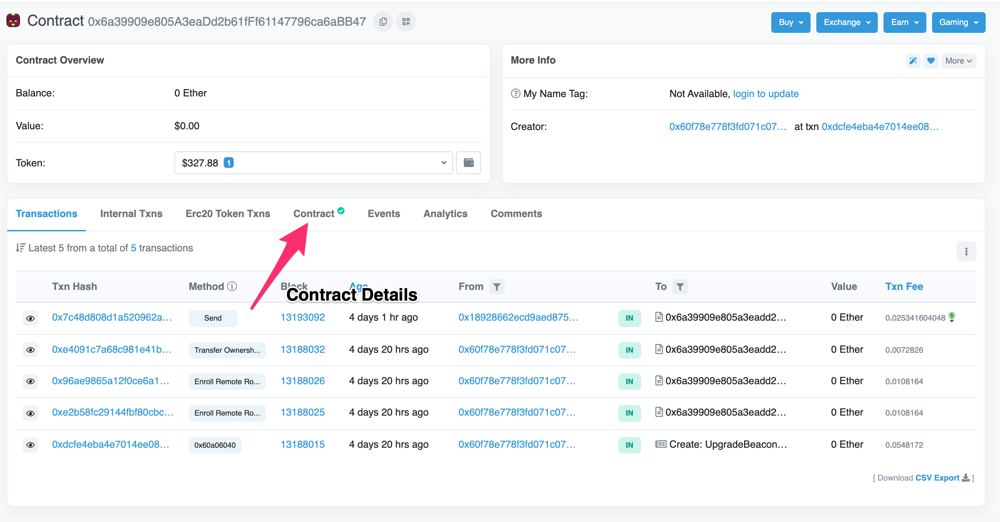

As mentioned, the contract we're looking at is a proxy, so we want to write to it using the "Write as Proxy" feature.  

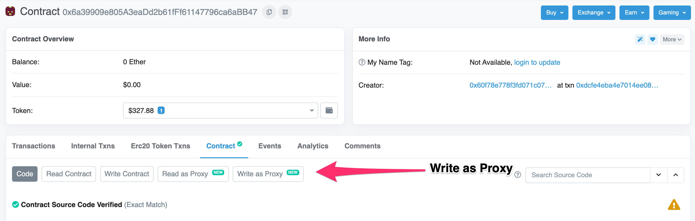

There is a list of methods available to us, the important one to a Bridge Ape is the `send` method. 

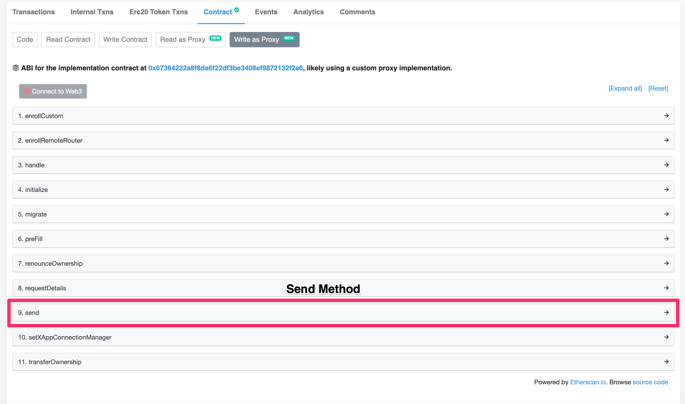

Selecting the `send` method expands the list of parameters which we will have to accurately fill in order to successfully send tokens across the bridge. 

## Step Three: Understand the Send Method 

There are a series of parameters for the send method which we will have to fill out in order to Ape tokens across the bridge. 

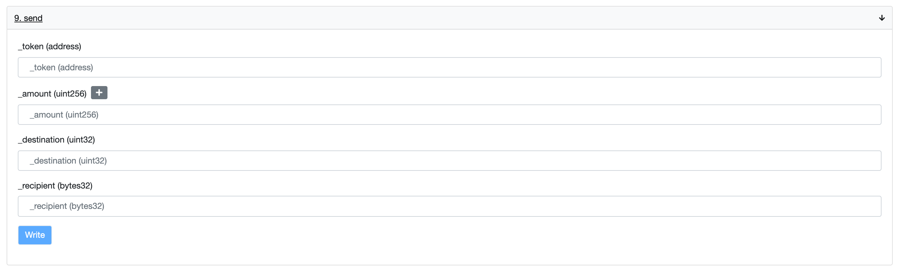

- `_token` - The Contract Address of the ERC-20 token which we will be bridging
- `_amount` - The amount of the token to send in wei, 10^18
- `_destination` - The domain of the destination chain, domains can be found in the [replica configuration on Github](https://github.com/celo-org/optics-monorepo/blob/main/rust/config/mainnet/ethereum_config.json#L21-L42)
- `_recipient` - The address of the recipient on the remote chain, bridged tokens will be sent to this address

Example Parameters for Bridging ETH from Ethereum to Celo are as follows: 

- `_token`: 
- `_amount`: 
- `_destination`: `1667591279`
- `_recipient`: 

Example Parameters for Bridging SUSHI from Ethereum to Celo are as follows: 

- `_token`: 
- `_amount`: 
- `_destination`: `1667591279`
- `_recipient`: 

Example Parameters for Bridging USDT from Ethereum to Celo are as follows: 

- `_token`: 
- `_amount`: 
- `_destination`: `1667591279`
- `_recipient`: 

## Step Four: Connect Metamask 

Using the Metamask integration within Etherscan, we can use the parameters above to submit a transaction that sends bridged tokens. 

First, select the "Connect to Web3" button on the contract UI. 

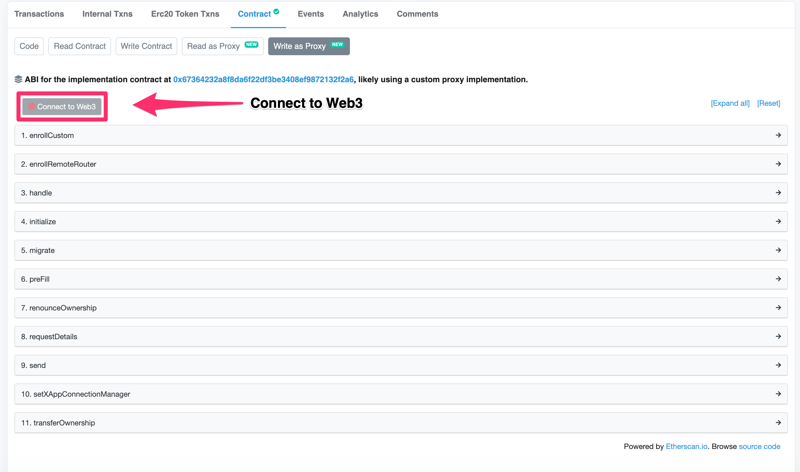

Select Metamask

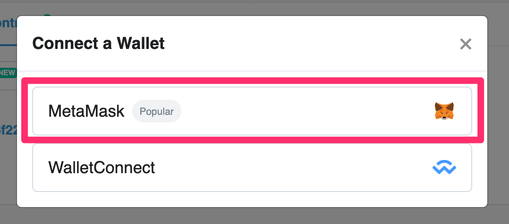

Then, walk through the Metamask connector flow by selecting an address. 

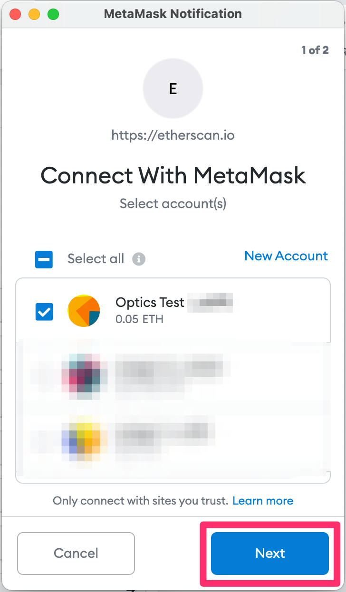

Confirm the selection and connect.

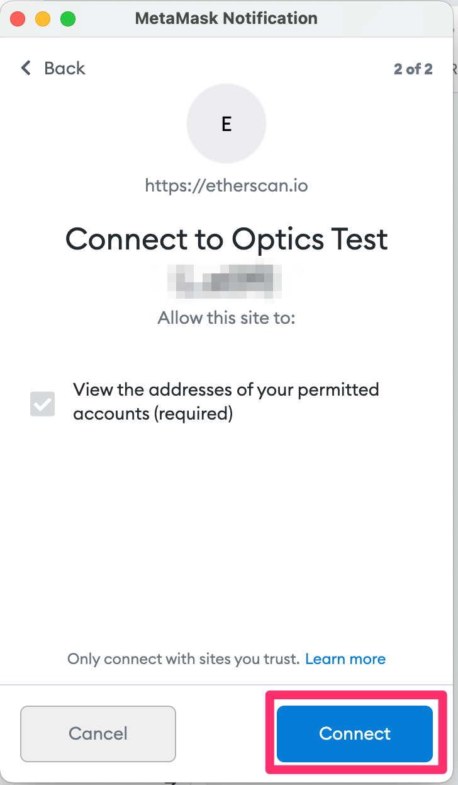

You should see that metamask is now reporting it is connected with the current website. 

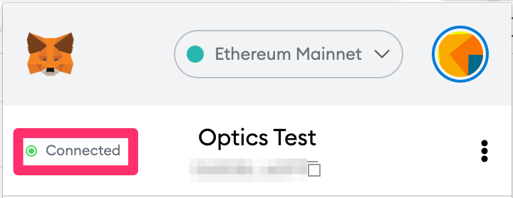

You can verify this in Etherscan as well, you might have to click the "Connect to Web3" button again in order to get it to pick up the change.

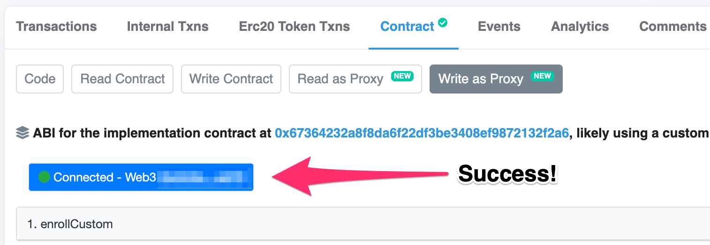

If all of this was successful, *you are ready for true Enlightenment*.

## Step Five: APE!

Now, we can put it all together. 

// TODO 